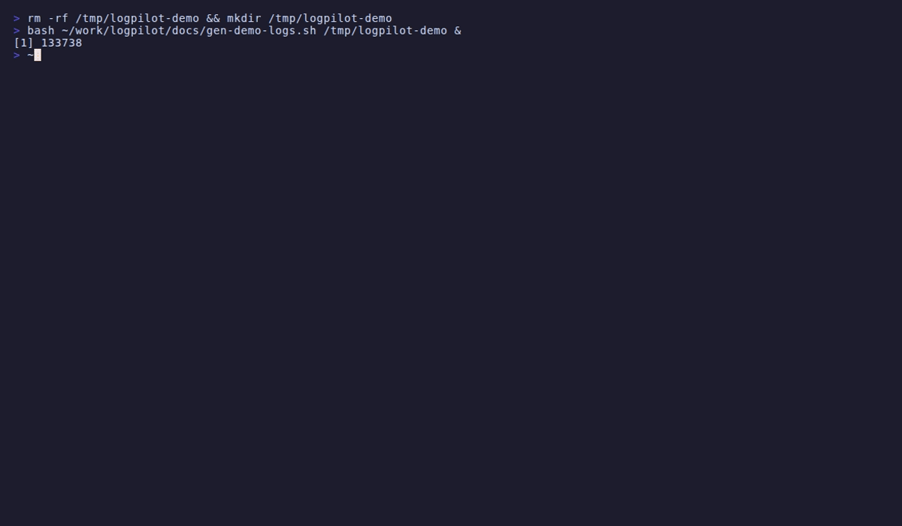

# logpilot

> All your service logs, one beautiful terminal.

[](https://go.dev)
[](LICENSE)
[](https://github.com/renaldid/logpilot/releases)

logpilot fans in log streams from **Docker Compose services**, **log files**, and **systemd units** into a single interactive terminal UI — with real-time fuzzy search, per-service filtering, and follow/scroll mode.

<!-- demo GIF coming soon — generate locally with: make demo -->


---

## Features

- **Multi-source fan-in** — watch Docker Compose services, plain log files, or a mix of both in one view
- **Real-time fuzzy search** — type to filter across all log messages instantly
- **Regex mode** — toggle between fuzzy and regex with `r`
- **Per-service sidebar** — enable/disable individual services with `Space`
- **Follow / scroll** — auto-scroll to the latest entry, or pause and browse history freely
- **Ring buffer** — keeps the last N entries in memory (configurable); older entries are evicted, not lost to disk
- **Log export** — dump the current filtered view to a timestamped `.log` file with `e`
- **Zero-config start** — works without a config file using sane defaults

---

## Installation

### go install

```sh
go install github.com/renaldid/logpilot@latest
```

### Binary release

Download a pre-built binary from the [releases page](https://github.com/renaldid/logpilot/releases).

```sh
# Linux (amd64)
curl -sL https://github.com/renaldid/logpilot/releases/latest/download/logpilot_Linux_x86_64.tar.gz \
  | tar xz -C /usr/local/bin logpilot
```

### Build from source

```sh
git clone https://github.com/renaldid/logpilot.git
cd logpilot
make build          # binary at bin/logpilot
```

---

## Quick start

Run without any config — logpilot starts up and waits for sources:

```sh
logpilot
```

To watch a Docker Compose project and a log file at the same time, create `.logpilot.yaml` in your project directory:

```yaml
buffer_size: 10000   # entries to keep in memory
follow: true         # auto-scroll to latest entry

sources:
  - name: api
    type: docker
    compose_file: docker-compose.yml

  - name: worker
    type: docker
    compose_file: docker-compose.yml

  - name: nginx
    type: file
    path: /var/log/nginx/access.log
```

Then run:

```sh
logpilot
# or point to a specific config:
logpilot --config /path/to/.logpilot.yaml
```

---

## Configuration reference

| Field | Type | Default | Description |
|---|---|---|---|
| `buffer_size` | int | `10000` | Maximum log entries kept in memory |
| `follow` | bool | `true` | Auto-scroll to the latest entry on startup |
| `colors` | map | — | Custom hex colors per service name |
| `sources` | list | `[]` | Log sources (see below) |

### Source types

**docker** — streams logs from all running containers in a Compose project:

```yaml
- name: myapp
  type: docker
  compose_file: docker-compose.yml   # path to your compose file
```

**file** — tails a plain text log file:

```yaml
- name: access
  type: file
  path: /var/log/nginx/access.log
```

### Custom service colors

```yaml
colors:
  api:    "#7C3AED"
  worker: "#059669"
  nginx:  "#2563EB"
```

---

## Keybindings

| Key | Action |
|---|---|
| `/` | Open search bar |
| `Tab` | Toggle focus: log view ↔ sidebar |
| `Space` | Toggle service on/off (sidebar focused) |
| `↑` / `k` | Scroll up one line |
| `↓` / `j` | Scroll down one line |
| `PgUp` / `PgDn` | Scroll half a page |
| `f` | Toggle follow mode |
| `r` | Toggle regex search |
| `c` | Clear all filters |
| `e` | Export filtered logs to `logpilot-export-<timestamp>.log` |
| `?` | Toggle help overlay |
| `q` / `Ctrl+C` | Quit |

---

## Architecture

logpilot is split into three clean layers with no circular dependencies:

```
┌─────────────────────────────────────────┐
│  cmd/root.go  (Cobra CLI, wires layers) │
└────────────────────┬────────────────────┘
                     │
        ┌────────────▼───────────┐
        │  internal/source       │  LogSource interface
        │  FileSource            │  TailFunc injectable
        │  DockerSource          │  DockerClient interface
        └────────────┬───────────┘
                     │ fan-in
        ┌────────────▼───────────┐
        │  internal/pipeline     │
        │  Aggregator            │  goroutine fan-in
        │  RingBuffer            │  thread-safe circular buffer
        │  Filter                │  fuzzy + regex, service/level masks
        └────────────┬───────────┘
                     │ <-chan LogEntry
        ┌────────────▼───────────┐
        │  internal/tui          │  BubbleTea model
        │  State (pure, no I/O)  │  fully unit-testable
        │  Model (thin wrapper)  │  delegates to State
        └────────────────────────┘
```

Key design decisions:

- **`LogSource` interface** — each source is independently startable, stoppable, and mockable
- **`TailFunc` injection** — file tailing is a function parameter, so `watchLoop` is testable without real files
- **`DockerClient` interface** — the Docker SDK is hidden behind an interface; tests use a mock
- **Pure `State` struct** — all TUI business logic lives in `State` with no BubbleTea dependencies; the `Model` is a thin event dispatcher
- **100% test coverage** — every business-logic branch is covered; only OS-level terminal/socket I/O is excluded

---

## Development

```sh
make test            # run all tests
make test-coverage   # tests + HTML coverage report
make build           # binary at bin/logpilot
make lint            # golangci-lint
make release-dry     # goreleaser snapshot (no publish)
```

### Project layout

```
cmd/           CLI entry point (Cobra)
internal/
  config/      Config loading (Viper + YAML)
  pipeline/    RingBuffer, Filter, Aggregator
  source/      FileSource, DockerSource, MockSource
  tui/         BubbleTea model, State, renderers
pkg/
  logentry/    LogEntry type, parser (JSON + text)
```

---

## License

MIT — see [LICENSE](LICENSE).
